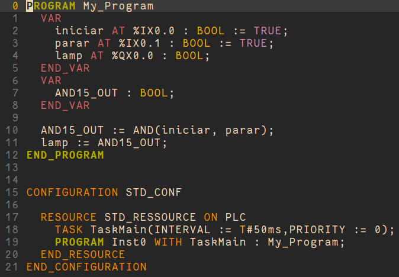

# IEC.vim

Vim mode for editing source code files for [IEC 61131-3](https://en.wikipedia.org/wiki/IEC_61131-3) textual programming languages: [Structured Text](https://en.wikipedia.org/wiki/Structured_text) and [Instruction List](https://en.wikipedia.org/wiki/Instruction_list).

# Screenshot

Here is an example in URxvt with [gruvbox](https://github.com/morhetz/gruvbox) color scheme:



# Installation

To install with vim/neovim [plug-vim](https://github.com/junegunn/vim-plug) add following line in your configuration file:

```
Plug 'https://github.com/jubnzv/IEC.vim'
```

# License

See [LICENSE](LICENSE) file.
